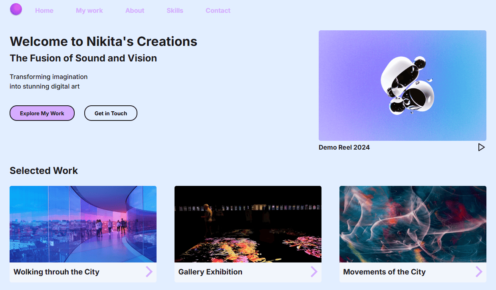
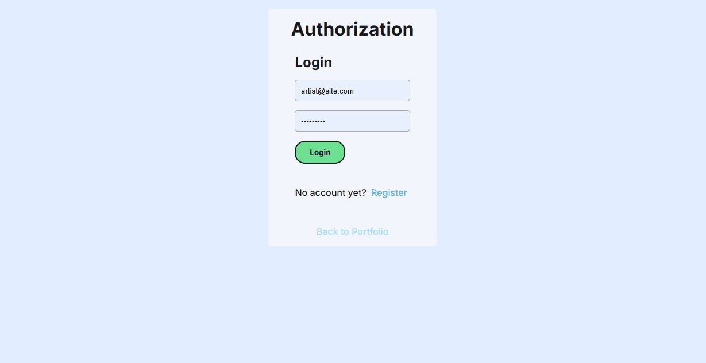
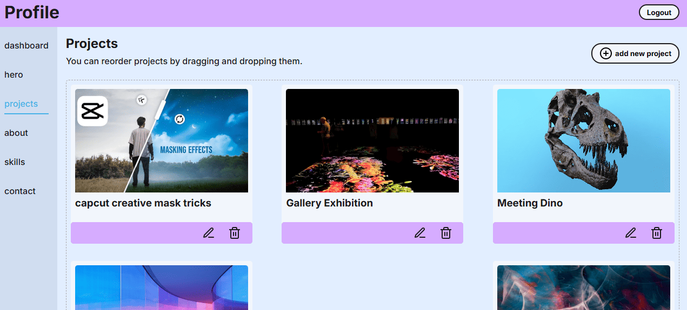
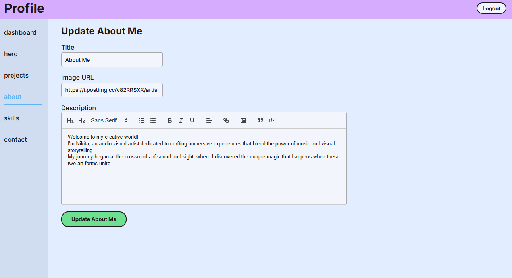
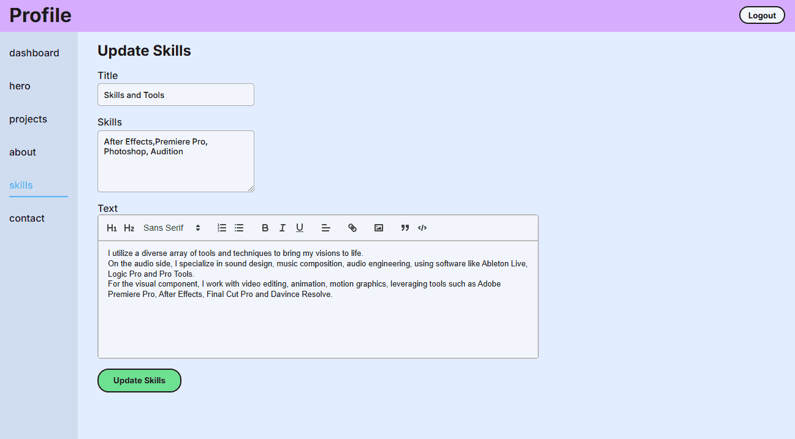

# artistfolio

## Portfolio Website for Artist

A dynamic and user-friendly portfolio website built with React, TypeScript, Node.js, JWT, and SCSS, designed to allow Artist to easily showcase their artwork and manage their content. 
This platform features a secure login system, an intuitive admin dashboard for adding and updating portfolio pieces, and a fully responsive front-end that adapts seamlessly across devices.

This project enables an Artist to update, add, and delete portfolio items effortlessly, ensuring their online presence remains up-to-date with minimal effort.

### Key Features:

- Interactive art showcase with image gallery
- Secure login and authentication using JWT
- Easy-to-use content management dashboard for the artist
- Responsive design optimized for both desktop and mobile
- Built with React (TypeScript), Node.js, JWT for secure back-end, and SCSS for styling

### Technologies Used:

- React & TypeScript: For dynamic, scalable front-end
- Node.js: For efficient, scalable back-end
- JWT: Secure authentication for user login
- SCSS: For clean, maintainable, responsive styling

### Previews

#### landing page

<!--  -->

#### authentication - login page

#### authentication - update pages

<a href="https://artistfolio.onrender.com/" style="color:#44B3EA; font-size:20px">
live demo
</a>

<!-- ## [live demo](https://artistfolio.onrender.com/) -->

<!-- https://artistfolio.onrender.com/auth/ -->
<!-- 

 -->
